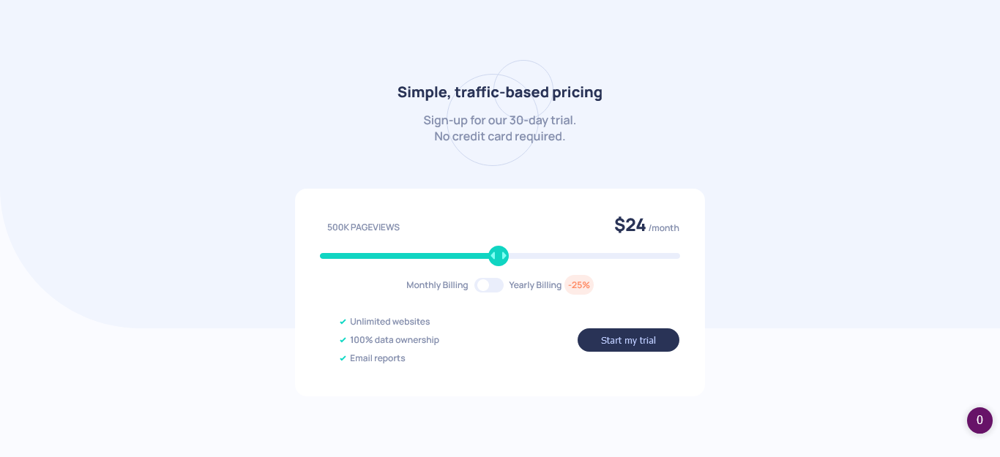

# Frontend Mentor - Interactive pricing component solution

This is a solution to the [Interactive pricing component challenge on Frontend Mentor](https://www.frontendmentor.io/challenges/interactive-pricing-component-t0m8PIyY8). Frontend Mentor challenges help you improve your coding skills by building realistic projects.

## Table of contents

- [Overview](#overview)
  - [Screenshot](#screenshot)
- [My process](#my-process)
  - [Built with](#built-with)
  - [What I learned](#what-i-learned)
  - [Continued development](#continued-development)
- [Acknowledgments](#acknowledgments)

## Overview

### Screenshot

## My process

### Built with

- Semantic HTML5 markup
- CSS custom properties
- Flexbox
- Javascript
- Mobile-first workflow

### What I learned

The biggest hurdle I encountered was styling the input range element. The progress bar like style was only implemented for Firefox since I couldn't find a suitable solution for the webkit browsers. Apart from this hurdle, the next biggest obstacle was styling the toggle switch. Each of these challenges required tedious CSS code.

### Continued development

In the future I'd like to use some type of framework or preprocessor to make the implementation and styling of these elements more streamlined.

## Acknowledgments

- [Article on styling input range elements](https://www.smashingmagazine.com/2021/12/create-custom-range-input-consistent-browsers/) - This article helped me to learn how to style input range elements consistently across browsers (it did not show how to style the progress bar like style)

- [Article on creating toggle switches](https://www.w3schools.com/howto/howto_css_switch.asp) - This article showed me how to create toggle switches

- [Article on -moz-range-progress](https://developer.mozilla.org/en-US/docs/Web/CSS/::-moz-range-progress) - This article provided the solution to styling the progress bar like style for input range elements on Firefox
